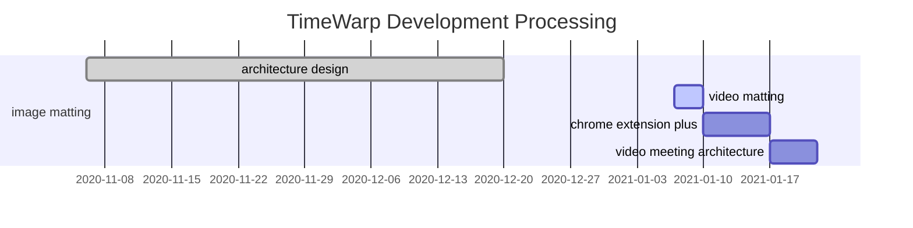
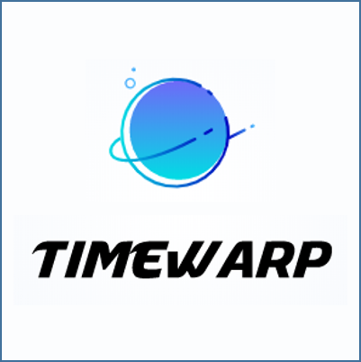

# TimeWarp - 在线视频背景替换
Replacing Real-Time the High-Resolution Meeting Background Freely. 
<!--
https://grail.cs.washington.edu/projects/background-matting-v2/visuals/teaser.jpg
-->
<br>
<div align="center">
    
</div>
<div class="teaser-caption">
    <i>Current video conferencing tools like Zoom can take an input feed (left) and replace the background, often introducing artifacts, as shown in the center result with close-ups of hair and glasses that still have the residual of the original background. Leveraging a frame of video without the subject (far left inset), our method produces real-time, high-resolution background matting without those common artifacts. The image on the right is our result with the corresponding close-ups, screenshot from our Zoom plugin implementation.</i>
</div>

<br>
👉 <a href="https://grail.cs.washington.edu/projects/background-matting-v2/img_results.html" target="_blank">See image results with interactive zoom-in</a>

## ✨ Features
- <b>Real-Time</b> High-Resolution Background Matting,  &nbsp;;
- Replacing our background in meeting screen;
- Replace background with <b>any size</b> photo you want;
- Cross mutil-platform, like zoom plugin, web-browser, miniprogram in PC, mobile and iPad, any platform with web service;
- IFLYTEK voice translation between Chinese and English;
- ...

## Overview
* [Updates](#updates)
* [Download](#download)
    * [Model / Weights](#model--weights)
    * [Video / Image Examples](#video--image-examples)
    * [Datasets](#datasets)
* [Build](#-build)
* [Demo](#-demo)
    * [Beta](#-beta)
    * [Scripts](#scripts)
    * [Notebooks](#notebooks)
* [Usage / Documentation](#usage--documentation)
* [Training](#training)
* [License](#-license)
* [Reference](#-reference)
* [Community](#-community)


## Updates

* [Jan 09 2021] [PhotoMatte85](https://drive.google.com/file/d/1KpHKYW986Dax9-ZIM7I-HyBoWVcLPuaQ/view) dataset is now published.
* [Dec 21 2020] We updated our project to MIT License, which permits commercial use!

## Download

### Model / Weights

* [Download model / weights](https://drive.google.com/drive/folders/1cbetlrKREitIgjnIikG1HdM4x72FtgBh?usp=sharing)

### Video / Image Examples

* [HD videos](https://drive.google.com/drive/folders/1j3BMrRFhFpfzJAe6P2WDtfanoeSCLPiq) (by [Sengupta et al.](https://github.com/senguptaumd/Background-Matting)) (Our model is more robust on HD footage)
* [4K videos and images](https://drive.google.com/drive/folders/16H6Vz3294J-DEzauw06j4IUARRqYGgRD?usp=sharing)


### Datasets

* VideoMatte240K (Coming soon)
* [PhotoMatte85](https://drive.google.com/file/d/1KpHKYW986Dax9-ZIM7I-HyBoWVcLPuaQ/view?usp=sharing)

## 🔨 Build

1. setup enviroment

```shell
# git clone https://github.com/Charmve/TimeWarp.git
# cd TimeWarp

# pip install -r requirements.txt
```

2. download dataset and model [``Download``](#download)

3. run test code
- Video 
```
# cd TimeWarp
# bash test_video.sh
```

- Image
```
# cd TimeWarp
# python3 test_image.py
```

## Demo

### 🎧 Beta

<div align="center">
    
    <br><b>demo</b> Real-Time High-Resolution Background Matting<sup>[1]</sup>
</div>

#### Have a <b>Try</b> ! 

➡️ [Web Demo by Gradio](https://gradio.app/g/BackgroundMattingV2): Matting your own images from your browser. 

#### Scripts

We provide several scripts in this repo for you to experiment with our model. More detailed instructions are included in the files.
* `inference_images.py`: Perform matting on a directory of images.
* `inference_video.py`: Perform matting on a video.
* `inference_webcam.py`: An interactive matting demo using your webcam.

#### Notebooks
Additionally, you can try our notebooks in Google Colab for performing matting on images and videos.

* [Image matting (Colab)](https://colab.research.google.com/drive/1cTxFq1YuoJ5QPqaTcnskwlHDolnjBkB9?usp=sharing)
* [Video matting (Colab)](https://colab.research.google.com/drive/1Y9zWfULc8-DDTSsCH-pX6Utw8skiJG5s?usp=sharing)

#### Virtual Camera
We provide a demo application that pipes webcam video through our model and outputs to a virtual camera. The script only works on Linux system and can be used in Zoom meetings. For more information, checkout:
* [Webcam plugin](https://github.com/andreyryabtsev/BGMv2-webcam-plugin-linux)

#### Web Demo
Developers in the community has helped us build a web demo. See [Community Projects](#community-projects) section below. 

## Usage / Documentation

You can run our model using **PyTorch**, **TorchScript**, **TensorFlow**, and **ONNX**. For detail about using our model, please check out the [Usage / Documentation](doc/model_usage.md) page.

#### 中文解读 ->
- [单块GPU实现4K分辨率每秒30帧，华盛顿大学实时视频抠图再升级，毛发细节到位](https://mp.weixin.qq.com/s/9ow2xAKrDecEGl2Gn0Y5MA)
- [整个世界都是你的绿幕：这个视频抠图换背景的方法着实真假难辨](https://mp.weixin.qq.com/s?__biz=MzA3MzI4MjgzMw==&mid=2650784247&idx=2&sn=b8808700fdeaa0e6eda7430d0f29d2ce&chksm=871a0589b06d8c9f17cc3374049773cf70f4a39ffbb5d39a1da32882b1ecd6e02453336414d9)

## Training

Training code will be released upon acceptance of the paper.

## ☕ Processing



- More update processing details, please click [HERE](./docs/Changelog.md) to see <b>CHANGLOG</b>. 

## 🔔 Update Reminder

[Subscribe -->](https://github.com/Charmve/TimeWarp/edit/main/README.md)

Business ✉️ email: yidazhang1@gmail.com

## 🍮 Community
- GitHub <a href="https://github.com/Charmve/TimeWarp/discussions" target="_blank">discussions 💬</a> or <a href="https://github.com/Charmve/TimeWarp/issues" target="_blank">issues 💭</a>

- QQ Group: 697948168 (password：TimeWarp)
- Email: yidazhang1#gmail.com 

<!--
## 💖 Sponsors and Backers
<a href="https://opencollective.com/charmve/donate" target="_blank">
  
</a>
-->

## 🔗 Reference

[1] Real-Time High-Resolution Background Matting. Shanchuan Lin*, Andrey Ryabtsev*, Soumyadip Sengupta. [[GitHub]](https://github.com/PeterL1n/BackgroundMattingV2) | [[arXiv]](https://arxiv.org/pdf/2012.07810.pdf) | [[data]](https://grail.cs.washington.edu/projects/background-matting-v2/)

[2] Background Matting: The World is Your Green Screen. Soumyadip Sengupta, Vivek Jayaram, Brian Curless, et.al. CVPR 2020. [[GitHub]](https://github.com/senguptaumd/Background-Matting) | [[arXiv]](https://arxiv.org/abs/2004.00626)

[3] MODNet: Is a Green Screen Really Necessary for Real-Time Portrait Matting? [[GitHub](https://github.com/ZHKKKe/MODNet)] | [[arXiv]](https://arxiv.org/pdf/2011.11961.pdf)

[4] High-Resolution Deep Image Matting. Haichao Yu, Ning Xu, Zilong Huang. [GitHub] | [[arXiv]](https://arxiv.org/pdf/2009.06613.pdf)

[5] End-to-end Animal Image Matting. Jizhizi Li, Jing Zhang, Stephen J. Maybank. [[GitHub]](https://github.com/JizhiziLi/animal-matting) | [[arXiv]](https://arxiv.org/pdf/2010.16188.pdf).

[6] BGMv2-webcam-plugin-linux. https://github.com/andreyryabtsev/BGMv2-webcam-plugin-linux

[7] Chrome-extensions-samples. https://github.com/GoogleChrome/chrome-extensions-samples

[8] Zoom Video Ingester. https://github.com/harvard-dce/zoom-recording-ingester

[9] Zoom Recording Downloader. https://github.com/ricardorodrigues-ca/zoom-recording-downloader


## 📜 License

This work is licensed under the [Creative Commons Attribution NonCommercial ShareAlike 4.0 License](https://creativecommons.org/licenses/by-nc-sa/4.0/legalcode).

## 💝 Acknowledge

Thanks for [PeterL1n](https://github.com/PeterL1n), et al. 

<br>
<p align="center">

<br>Feel free to ask any questions, open a PR if you feel something can be done differently!</p>
<h2 align="center">🌟Star this repository🌟</h2>
<p align="center">Created by <a href="https://github.com/Charmve">Charmve</a> & <a href="https://github.com/MaiweiAI">maiwei.ai</a> Community | Deployed on <a href="https://gradio.app/g/BackgroundMattingV2">Gradio.app</a></p>
