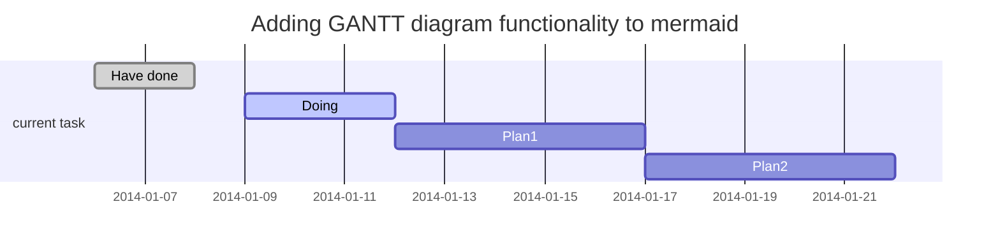

# TimeWarp
Replacing Real-Time the High-Resolution Meeting Background Freely. 

<div align="center">
    
</div>
<div class="teaser-caption">
    <i>Current video conferencing tools like Zoom can take an input feed (left) and replace the background, often introducing artifacts, as shown in the center result with close-ups of hair and glasses that still have the residual of the original background. Leveraging a frame of video without the subject (far left inset), our method produces real-time, high-resolution background matting without those common artifacts. The image on the right is our result with the corresponding close-ups, screenshot from our Zoom plugin implementation.</i>
</div>

<br>
👉 <a href="https://grail.cs.washington.edu/projects/background-matting-v2/img_results.html" target="_blank">See image results with interactive zoom-in</a>

## ✨ Features
- <b>Real-Time</b> High-Resolution Background Matting;
- Replacing our background in meeting screen;
- Replace background with <b>any size</b> photo you want;
- Cross mutil-platform, like zoom plugin, web-browser, miniprogram in PC, mobile and iPad, any platform with web service;
- IFLYTEK voice translate between Chinese and English;
- ...

## 🎧 Beta

<div align="center">
    
    <br><b>demo</b> Real-Time High-Resolution Background Matting
</div>

<br>
🍅 Have a <b>Try</b> https://gradio.app/g/BackgroundMattingV2


## 🔨 Build

```python
# git clone https://github.com/Charmve/TimeWarp.git

# cd TimeWarp

# mkdir build

# make

# cd build

# ./TimeWarp
```

## ☕ Processing



- More update processing details, please click [HERE](./docs/Changelog.md) to see <b>CHANGLOG</b>. 

## 🔔 Update Reminder

[Subscribe -->](https://github.com/Charmve/TimeWarp/edit/main/README.md)

Business ✉️ email: yidazhang1@gmail.com

## 🍮 Community
<a href="https://github.com/Charmve/TimeWarp/discussions" target="_blank">discussions 💬</a> or <a href="https://github.com/Charmve/TimeWarp/issues" target="_blank">issues 💭</a>

## 🔗 Reference

[1] https://github.com/PeterL1n/BackgroundMattingV2

[2] https://github.com/GoogleChrome/chrome-extensions-samples

[3] BGMv2-webcam-plugin-linux. https://github.com/andreyryabtsev/BGMv2-webcam-plugin-linux

## 📜 License

This work is licensed under the [Creative Commons Attribution NonCommercial ShareAlike 4.0 License](https://creativecommons.org/licenses/by-nc-sa/4.0/legalcode).

## 💝 Acknowledge

Thanks for [PeterL1n](https://github.com/PeterL1n), et al. 

